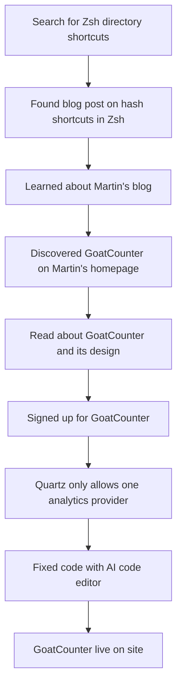

---
tags:
  - "#rabbithole"
  - "#TIL"
created: 2024-12-04  02:39
draft: false
---
## the rabbithole

1. i searched for how to do [[shortcut to directories in zsh|directory shortcuts on zsh]] - [on perplexity of course](https://www.perplexity.ai/search/shortcut-to-a-directory-in-zsh-zgn7I8NjRCylPa3l4W8nvA#0)
2. found this [blog](https://til.hashrocket.com/posts/xsavbhlrz4-shortcuts-with-hash-d-in-zsh) as the source
3. the blog's author found it from [Martin's blog](https://www.arp242.net/zshrc.html)
4. now, I found Martin's blog to be pretty interesting. went to his home page to know more about this person. 
5. and I saw goatcounter, which has 4k+ stars on Github. seemed interesting. [Click](https://www.goatcounter.com/). 
6. read through [why he built goatcounter](https://www.goatcounter.com/why) and loved it. i also liked the [design note](https://www.goatcounter.com/design) and [his blog on personal analytics](https://www.arp242.net/personal-analytics.html) as well. 
7. signed up. set it up on my site
8. quartz code allows only one analytics provider. 
9. changed code with Windsurf (AI code editor) to use multiple providers. Ez. 
10. it is live now [here](https://sanjeed.goatcounter.com/) and [[site Analytics|here]].

> [!question] What was a rabbithole you enjoyed recently?

---
### rabbithole visualized 

